# 红线 · 我们的相册

> 两个人本来是两条线。
> 后来并成了一条，一直开到现在。

一本画成地铁线路图的恋爱相册：两个人各是一条线（一蓝一黄），在一起的那天并成一条红线；
一起出去玩的旅程、一起过的日常，都是这条线上的一站。
照片分“只给彼此”和“公开”两种——公开的那部分就是对外的相册；只给彼此的留在两个人的小窝里。
等到结婚的时候，线路图的尽头多出一站“婚礼”：客人收到一张印着自己名字的车票，检过票就是请柬，还能坐回来翻你们的相册。

用 Next.js + Postgres 写成，照片放在对象存储里（Cloudflare R2 / AWS S3 / MinIO / 阿里云 OSS / 腾讯云 COS / Vercel Blob）。
可以一键部署到 Vercel，也可以用 Docker 部署在自己的服务器上，方便国内访问。

**照片放在哪？** 放在你们自己的对象存储里，推荐 **Cloudflare R2**（有免费额度，下载流量不收费）。
照片从浏览器直接传进存储桶，不经过服务器，更不会进 Git 仓库；数据库只存每张照片的文字信息（时间、地点、说明、在存储桶里的路径），
GitHub 仓库里只有代码和示例插画。

先花几分钟[准备好 R2](#准备-cloudflare-r2)，再点：

[](https://vercel.com/new/clone?repository-url=https%3A%2F%2Fgithub.com%2Fwhrss9527%2Fred-thread&project-name=our-album&repository-name=our-album&env=AUTH_SECRET%2CADMIN_EMAIL%2CADMIN_PASSWORD%2CNEXT_PUBLIC_CLOUDFLARE_R2_ACCOUNT_ID%2CNEXT_PUBLIC_CLOUDFLARE_R2_BUCKET%2CCLOUDFLARE_R2_ACCESS_KEY%2CCLOUDFLARE_R2_SECRET_ACCESS_KEY&envDescription=AUTH_SECRET%EF%BC%9A%E8%87%B3%E5%B0%91%2016%20%E4%BD%8D%E7%9A%84%E9%9A%8F%E6%9C%BA%E5%AD%97%E7%AC%A6%EF%BC%88%E5%8F%AF%E4%BB%A5%E7%94%A8%20generate-secret.vercel.app%2F32%20%E7%94%9F%E6%88%90%EF%BC%89%E3%80%82ADMIN_EMAIL%20%2F%20ADMIN_PASSWORD%EF%BC%9A%E7%99%BB%E5%BD%95%E5%90%8E%E5%8F%B0%E7%94%A8%E7%9A%84%E9%82%AE%E7%AE%B1%E5%92%8C%E5%AF%86%E7%A0%81%E3%80%82%E5%85%B6%E4%BD%99%E5%9B%9B%E4%B8%AA%E6%9D%A5%E8%87%AA%20Cloudflare%20R2%EF%BC%88%E7%85%A7%E7%89%87%E5%B0%B1%E5%AD%98%E5%9C%A8%E9%82%A3%E9%87%8C%EF%BC%89%EF%BC%9AAccount%20ID%E3%80%81%E5%AD%98%E5%82%A8%E6%A1%B6%E5%90%8D%E5%AD%97%E3%80%81API%20%E4%BB%A4%E7%89%8C%E7%9A%84%20Access%20Key%20ID%20%E5%92%8C%20Secret%20Access%20Key%E3%80%82&envLink=https%3A%2F%2Fgithub.com%2Fwhrss9527%2Fred-thread%23%E5%87%86%E5%A4%87-cloudflare-r2&stores=%5B%7B%22type%22%3A%22integration%22%2C%22integrationSlug%22%3A%22neon%22%2C%22productSlug%22%3A%22neon%22%2C%22protocol%22%3A%22storage%22%7D%5D)


---

## 它能做什么

### 相册（`/`，所有人都能看）

| | |
|---|---|
| **封面** | 两个人的名字，下面各有一条自己颜色的线；精选照片剪成拱门、圆形和胶囊三种形状，贴着一枚慢慢转的贴纸。一张小线路图：两条线在“在一起”的那天并成红线，一直开到“现在”，旁边是“本线已安全运行 N 天”，秒针在走。 |
| **沿线站点** | 公开的回忆按时间排成站点，站名、日期、地点、一排照片。往下滑，红线跟着填满，一个小圆点标出“列车”开到了哪里，经过的站点会亮起来；初遇、纪念日、里程碑是换乘站。尽头是“下一站，还没想好”，或者“即将开通：婚礼”。 |
| **每一站一页** | 点开任意一站（`/moments/…`）是一块站牌：大大的站名，下面一条红色色带写着上一站和下一站。照片保持原本的横竖比例，每张下面写着日期。 |
| **全部照片** | `/photos` 按年份从近到远排好，一张不落。 |
| **大图** | 点开照片看大图，有字的照片可以**翻到背面**看写在背后的话；**双击照片**，会用红笔把那一处圈出来，旁边写着“就这张！”。 |
| **只给彼此看的** | 公开的站点里如果还有私密照片，只写一句“另有 3 张，仅限两位乘客”，照片本身不会出现。 |
| **花絮 · 途经 · 运营数据** | 没写进任何一站的照片印成一条胶片小样，背面写了字的那几张用红笔圈着；去过的地方画成车门上方那种线路图；还有“安全运行 N 天、一起过的周末、全部准点的情人节、剩余里程 ∞”。 |
| **留言** | 朋友们留一句话，你们审核后贴成一个个对话气泡。 |
| **终点站** | 页面最后是一块终点站站牌：“本线路仍在延长中”。（悄悄话：连按终点站的圆点五下，会带你们回小窝。） |

<p>
  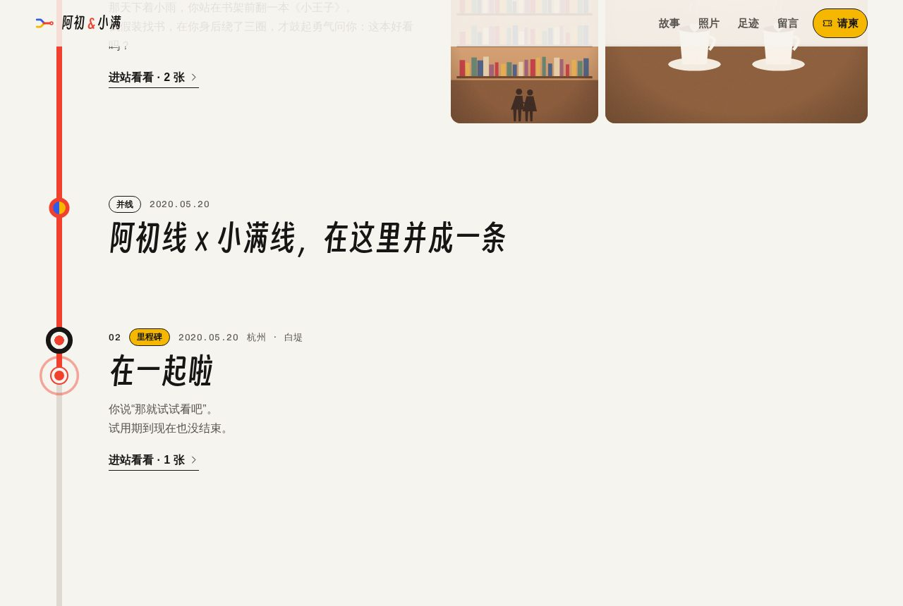
</p>
<p>
  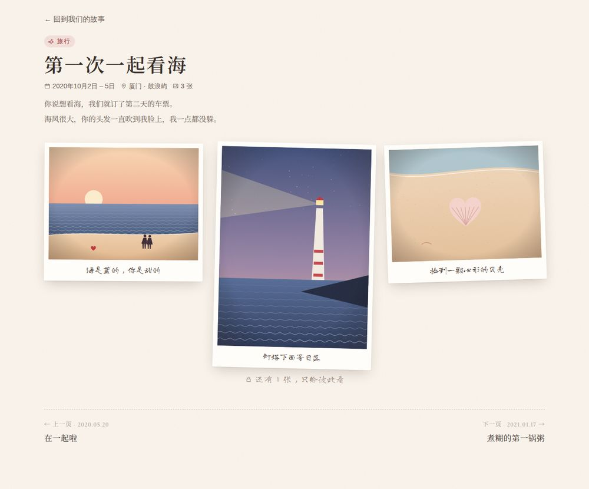
  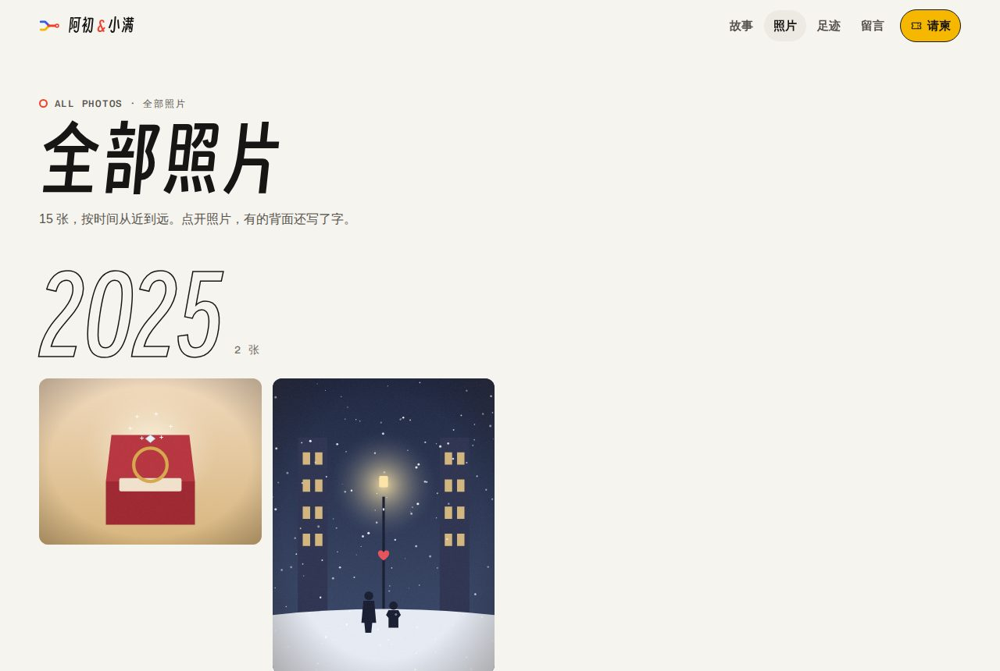
</p>
<p>
  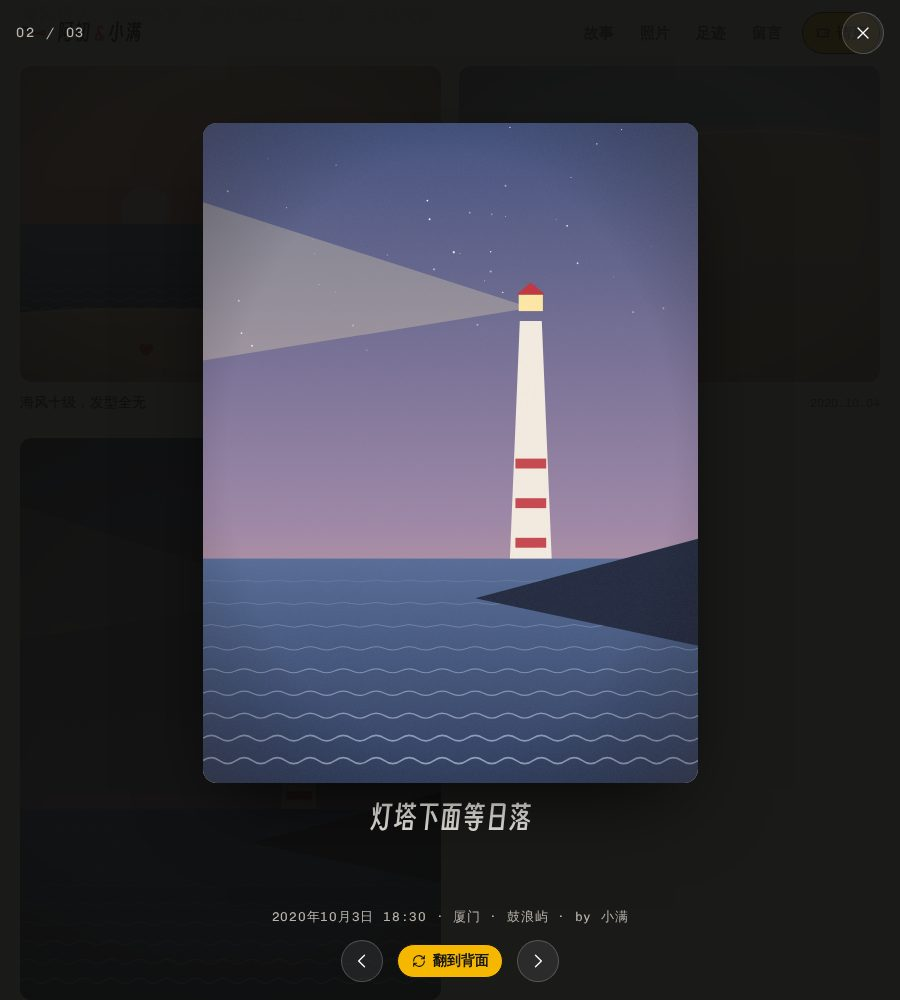
  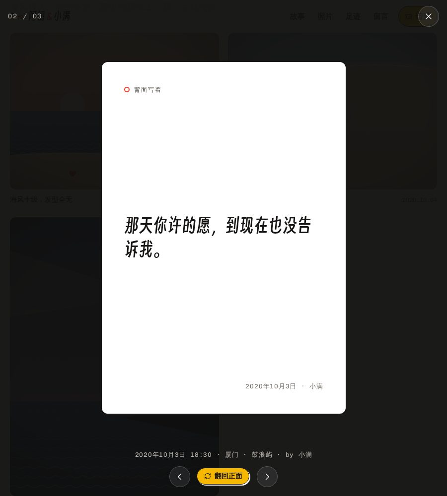
  
</p>
<p>
  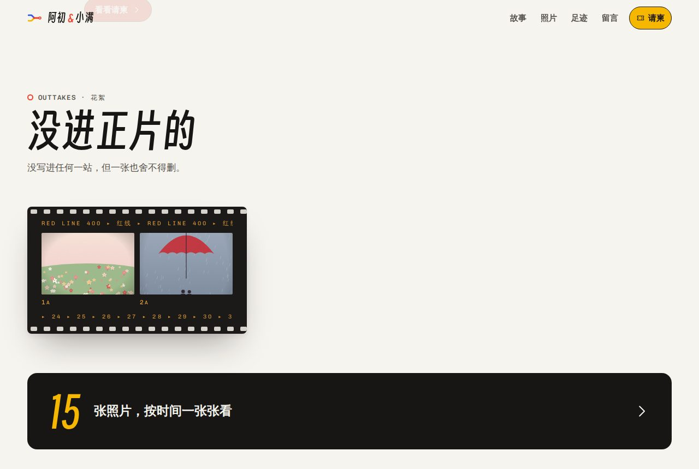
  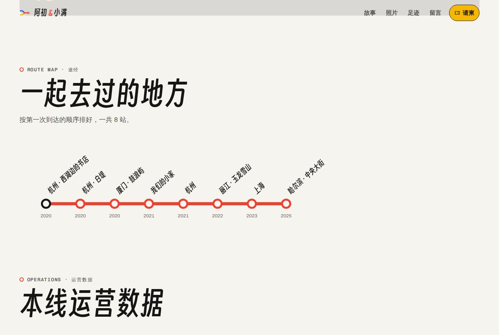
</p>
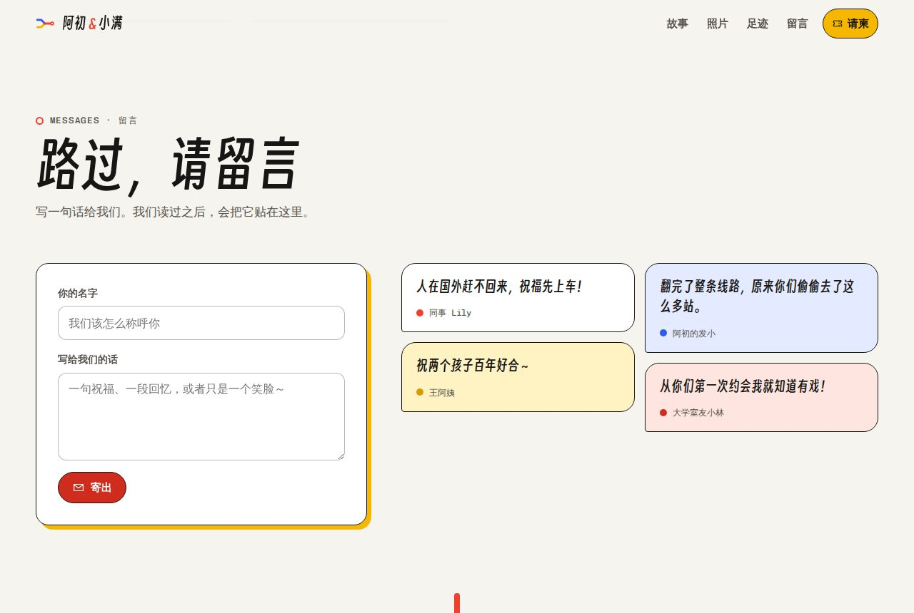

### 婚礼请柬（相册里的一个入口，`/invitation`）

在后台打开“婚礼请柬”后，线路图的尽头会出现“即将开通：婚礼”，导航栏多一个请柬入口；没打开之前，相册里看不到任何和请柬有关的东西。

- **一张写着名字的车票**：用专属链接 `/invitation?to=王小明` 打开，是一张“婚礼专列”的车票：乘客王小明，出发“你在的地方”，到达你们的婚礼场地，座位“随便坐，离我们近点”，票价“一句祝福”。点“检票”，票上打出一个孔，纸屑飞出来，背景音乐也在这一刻响起。
- **请柬**：像车站的发车信息牌——翻牌数字的日期和发车时间、到达的场地和地址，一键打开高德 / 百度 / Apple 地图，一键加入日历（`.ics`，提前一天提醒）；当天的流程排成一张时刻表，还有着装建议和实时倒计时。
- **窗外的风景**：请柬下面是一扇车窗，你们的照片像窗外的风景一样一张张经过，再往下是“翻开我们的相册”。
- **回执**：是否出席、几位、联系方式（只有你们看得到），再写一句祝福；祝福审核后贴到相册的留言里。
- 以后把请柬关掉，印在纸质请柬上的二维码也不会失效，会直接打开相册。

<p>
  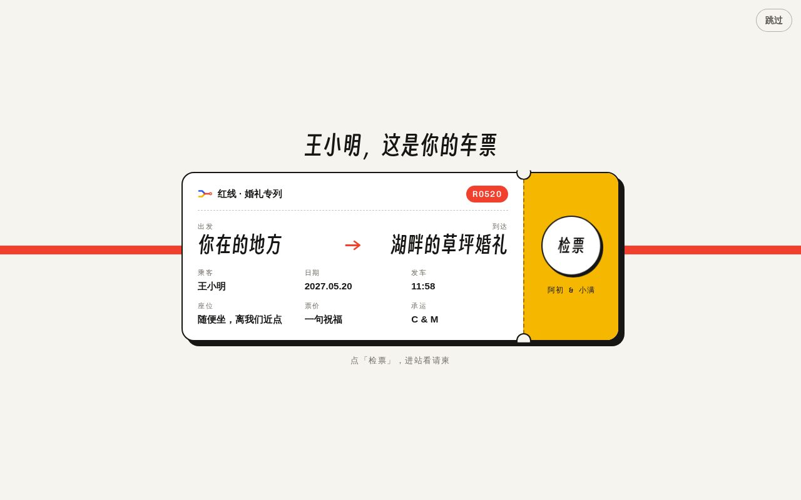
  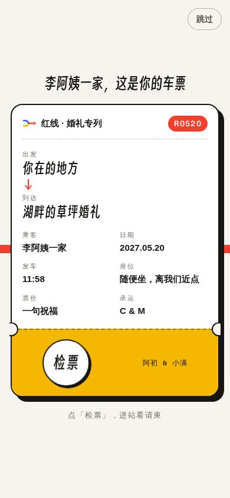
</p>
<p>
  
  
</p>

### 分享

- 后台“分享”页：相册和请柬各有链接和可下载的二维码；粘贴宾客名单，每人生成一个带名字的请柬链接和二维码，二维码可以直接印在纸质请柬上。
- **嵌入代码**：`/embed` 是一扇会自己换风景的车窗，点一下进相册。电子请柬、博客这类支持嵌入网页的地方，用 iframe 放进去就行（`?bg=transparent` 透明背景）。

<p>
  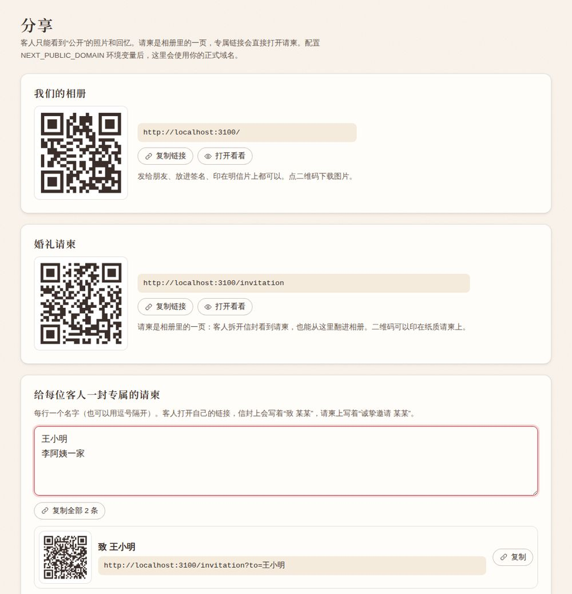
  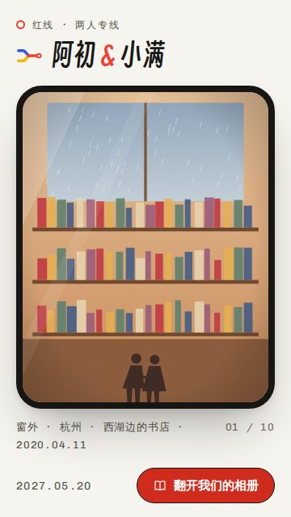
</p>

### 只属于两个人的小窝（`/us`，需要登录）

- **今天**：早安 / 晚安问候，“今天是我们在一起的第 N 天”，接下来的纪念日倒数（第 1000 天、520 天、周年、婚礼……）。
- **那年今日**：往年今天拍的照片；没有的话看看那些年的这几天。
- **抽一张回忆**：随手翻到一张，私密的也在里面。
- **照片日历**：每个有照片的日子都铺着那天的照片，纪念日会标出来。
- **回忆 & 所有照片**：按站点或全部浏览，私密照片带小锁，最爱的带红色小心。

<p>
  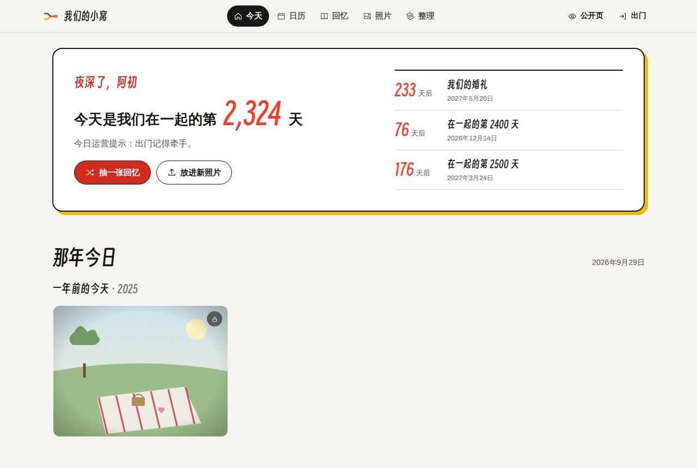
  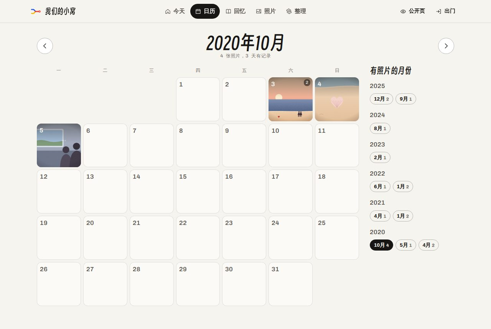
</p>

### 整理相册（`/admin`）

- **上传**：一次拖进一堆照片。照片在**浏览器里**读取 EXIF（拍摄时间、相机、GPS）、转换 iPhone 的 HEIC、压缩成 2400px 大图和 800px 小图、生成模糊占位图和主色，然后**直接传到存储桶**，服务器不经手照片本身（所以不受 Vercel 4.5MB 请求体的限制）。可选同时保存原图。
- **批量整理**：勾选多张照片 → 公开 / 私密 / 精选 / 最爱 / 放进某段回忆 / 删除，或者“用它们新建回忆”（自动填好日期和地点）。
- **回忆章节**：标题、类型、日期、地点、故事、封面、是否公开。
- **我们 & 请柬**：名字、在一起的日子、一句话、背景音乐（可以直接上传一首）；婚礼请柬的开关、时间地点、车票上的话；回执设置。
- **回执与留言**：出席人数统计、审核留言、导出 Excel 可以打开的 CSV。
- **示例数据**：新装好的站点可以一键填入一套插画示例，看看整本相册的样子，随时一键清除。

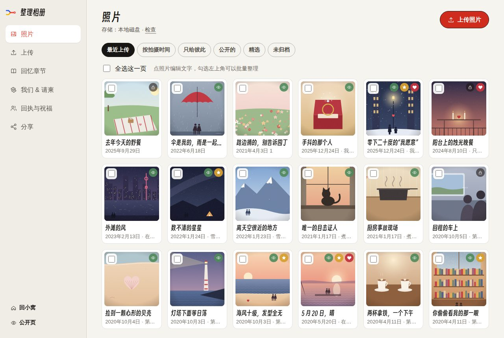

---

## 隐私是怎么做的

- 每张照片、每段回忆都有“只给彼此 / 公开”两种状态，**上传默认是只给彼此**。
- 客人能拿到的只有公开照片的展示图：没有原图、没有 GPS、没有相机信息。展示图是在浏览器里用 canvas 重新编码的，**文件里不带任何 EXIF**，定位只保存在数据库里给你们看。
- 私密照片不会出现在公开页面、嵌入页、分享卡片里；存储路径里带 20 位随机串，没法猜。
- 进一步的保护取决于存储方式：
  - **S3 / R2 / MinIO / OSS / COS**：私密照片永远用临时签名链接读取；设置 `STORAGE_SIGNED_URLS=1` 并把存储桶设为私有后，连公开照片也走签名链接。
  - **本地磁盘（Docker）**：私密照片和原图由服务器检查登录后才返回。
  - **Vercel Blob**：Blob 存储本身是公开的，私密照片靠不可猜的链接保护——在意这一点的话选上面两种。
- 登录用 `AUTH_SECRET` 签名的 httpOnly Cookie；后台、小窝不允许被别的网站嵌入；连续输错密码会被暂停一分钟。
- 祝福表单有蜜罐字段和按 IP 的频率限制，联系方式只在后台可见。

---

## 部署到 Vercel

分两步：先在 Cloudflare 建好放照片的存储桶，再点一键部署。数据库（Neon）会在部署时自动开好。

### 准备 Cloudflare R2

1. 打开 [Cloudflare 控制台](https://dash.cloudflare.com) → **R2 对象存储**。第一次用要先开通（需要绑定一张卡或 PayPal，免费额度内不扣费）。
2. **创建存储桶**：名字比如 `our-album`，位置提示选 **亚太地区（Asia-Pacific）**，其余保持默认。
3. **允许网页上传（CORS）**：存储桶 → **设置** → **CORS 策略** → 添加，把下面这段贴进去保存：

   ```json
   [
     {
       "AllowedOrigins": ["*"],
       "AllowedMethods": ["GET", "PUT"],
       "AllowedHeaders": ["content-type", "cache-control"],
       "MaxAgeSeconds": 3600
     }
   ]
   ```

   照片是从浏览器直接传进存储桶的，所以要允许网页上传。来源写 `*` 也是安全的：每次上传都要带服务器签发的临时签名，没有签名谁也写不进来。
4. **创建 API 令牌**：回到 R2 概览页 → **管理 API 令牌**（Manage API Tokens）→ 创建令牌。权限选 **对象读和写（Object Read & Write）**，
   范围选“仅应用于指定存储桶”并选上 `our-album`。创建后记下 **访问密钥 ID（Access Key ID）** 和 **机密访问密钥（Secret Access Key）**，后者只显示这一次。
5. **Account ID**：R2 概览页上就有，也是 S3 地址 `https://<Account ID>.r2.cloudflarestorage.com` 里的那一串。
6. **绑定自己的域名（可选，推荐）**：存储桶 → **设置** → **自定义域** → 连接域名，比如 `photos.example.com`（这个域名要托管在 Cloudflare）。
   公开照片会走这个域名和 Cloudflare 的 CDN，打开更快。不绑也能用，所有照片都会走临时签名链接。
   `r2.dev` 那个开发用的地址有限速，在国内也打不开，别用它。

部署时这样填：

| Cloudflare 里的 | 环境变量 |
|---|---|
| Account ID | `NEXT_PUBLIC_CLOUDFLARE_R2_ACCOUNT_ID` |
| 存储桶名字 | `NEXT_PUBLIC_CLOUDFLARE_R2_BUCKET` |
| Access Key ID | `CLOUDFLARE_R2_ACCESS_KEY` |
| Secret Access Key | `CLOUDFLARE_R2_SECRET_ACCESS_KEY` |
| 自定义域名（第 6 步，可选） | `NEXT_PUBLIC_CLOUDFLARE_R2_PUBLIC_DOMAIN`，部署好以后再加 |

### 一键部署

[](https://vercel.com/new/clone?repository-url=https%3A%2F%2Fgithub.com%2Fwhrss9527%2Fred-thread&project-name=our-album&repository-name=our-album&env=AUTH_SECRET%2CADMIN_EMAIL%2CADMIN_PASSWORD%2CNEXT_PUBLIC_CLOUDFLARE_R2_ACCOUNT_ID%2CNEXT_PUBLIC_CLOUDFLARE_R2_BUCKET%2CCLOUDFLARE_R2_ACCESS_KEY%2CCLOUDFLARE_R2_SECRET_ACCESS_KEY&envDescription=AUTH_SECRET%EF%BC%9A%E8%87%B3%E5%B0%91%2016%20%E4%BD%8D%E7%9A%84%E9%9A%8F%E6%9C%BA%E5%AD%97%E7%AC%A6%EF%BC%88%E5%8F%AF%E4%BB%A5%E7%94%A8%20generate-secret.vercel.app%2F32%20%E7%94%9F%E6%88%90%EF%BC%89%E3%80%82ADMIN_EMAIL%20%2F%20ADMIN_PASSWORD%EF%BC%9A%E7%99%BB%E5%BD%95%E5%90%8E%E5%8F%B0%E7%94%A8%E7%9A%84%E9%82%AE%E7%AE%B1%E5%92%8C%E5%AF%86%E7%A0%81%E3%80%82%E5%85%B6%E4%BD%99%E5%9B%9B%E4%B8%AA%E6%9D%A5%E8%87%AA%20Cloudflare%20R2%EF%BC%88%E7%85%A7%E7%89%87%E5%B0%B1%E5%AD%98%E5%9C%A8%E9%82%A3%E9%87%8C%EF%BC%89%EF%BC%9AAccount%20ID%E3%80%81%E5%AD%98%E5%82%A8%E6%A1%B6%E5%90%8D%E5%AD%97%E3%80%81API%20%E4%BB%A4%E7%89%8C%E7%9A%84%20Access%20Key%20ID%20%E5%92%8C%20Secret%20Access%20Key%E3%80%82&envLink=https%3A%2F%2Fgithub.com%2Fwhrss9527%2Fred-thread%23%E5%87%86%E5%A4%87-cloudflare-r2&stores=%5B%7B%22type%22%3A%22integration%22%2C%22integrationSlug%22%3A%22neon%22%2C%22productSlug%22%3A%22neon%22%2C%22protocol%22%3A%22storage%22%7D%5D)

点这个按钮，Vercel 会一步步带你走完：

1. **在你的 GitHub 里建一份自己的仓库**：名字默认是 `our-album`，可以改。建议勾选私有（Private），以后你们改了什么都只有自己看得到。
2. **开好数据库**：Neon（Postgres），连接信息会自动填进环境变量。国内访问的话，Neon 的地区建议选 **Singapore**。
3. **填七个环境变量**：
   - `AUTH_SECRET`：至少 16 位的随机字符，用来给登录签名。在 <https://generate-secret.vercel.app/32> 生成一串复制过来就行
   - `ADMIN_EMAIL` / `ADMIN_PASSWORD`：你登录后台用的邮箱和密码
   - R2 的四个值：见上面的表
4. 部署好以后打开 `你的网址/admin` 登录，先到“上传”页点 **检查照片存储**：它会从你的浏览器传一张测试照片、打开、再删掉，
   哪一步不对会直接说该改哪里（比如 CORS 规则没加，它会把要贴的规则给你）。
5. 在“我们 & 请柬”里填好名字和在一起的日子；可以先在“照片”页点“用示例数据看看效果”。婚礼请柬默认是关着的，定好日子再打开。

之后还可以在 Vercel 项目的 Settings → Environment Variables 里加上 Ta 的账号（`PARTNER_EMAIL` / `PARTNER_PASSWORD`）、
正式域名（`NEXT_PUBLIC_DOMAIN`）和 R2 的自定义域名（`NEXT_PUBLIC_CLOUDFLARE_R2_PUBLIC_DOMAIN`），加完到 Deployments 里对最新一次部署点 ··· → Redeploy。

> 如果部署后打不开，去登录页看看：缺数据库、照片存储还是密钥，那里会一条条写出来。

数据表会在第一次访问时自动创建，不需要手动迁移。

### 或者：直接导入仓库

一键部署会复制出一份新的仓库。如果你想让网站跟着某个仓库自动更新（比如你 fork 了这个仓库，或者你就是它的主人），也可以手动导入：

1. 照着上面[准备好 R2](#准备-cloudflare-r2)。
2. Vercel → Add New → Project → 选这个仓库，其余保持默认。
3. 项目 → Storage：连接 **Neon**（Postgres）。
4. 项目 → Settings → Environment Variables：填好 `AUTH_SECRET`、`ADMIN_EMAIL`、`ADMIN_PASSWORD` 和 R2 的四个变量。
5. Deployments → Redeploy。以后仓库每次更新都会自动部署。

### 国内访问

- `*.vercel.app` 在国内基本打不开，**一定要绑定自己的域名**（Vercel → Settings → Domains）。
- 把 Vercel 项目的函数地区（Settings → Functions → Function Region）设成 **Singapore**，和 Neon 的 Singapore 放在一起，页面会快很多。
- 照片：R2 请绑定自己的域名（`r2.dev` 在国内打不开）。上传和私密照片走的是 R2 的 S3 地址（`<Account ID>.r2.cloudflarestorage.com`），
  你们的网络连不连得上它，“检查照片存储”会告诉你。
- 想要最稳的国内访问：用 **Docker 部署在国内服务器上 + 阿里云 OSS / 腾讯云 COS**（见下文），国内服务器需要 ICP 备案。
- 字体全部随网站一起分发，不依赖 Google Fonts。

---

## 环境变量

| 变量 | 必填 | 说明 |
|---|---|---|
| `AUTH_SECRET` | 是 | 至少 16 位的随机字符，用来给登录签名。可以在 <https://generate-secret.vercel.app/32> 生成，或者运行 `openssl rand -base64 32` |
| `ADMIN_EMAIL` / `ADMIN_PASSWORD` | 是 | 你的账号（“我们 & 请柬”里的第一个名字） |
| `PARTNER_EMAIL` / `PARTNER_PASSWORD` | | Ta 的账号（第二个名字）。两个人各用各的，上传的照片会记下是谁传的 |
| `NEXT_PUBLIC_DOMAIN` | | 正式域名，例如 `love.example.com`，用在分享链接和二维码里。不填的话，在 Vercel 上会用项目的生产域名 |
| `NEXT_PUBLIC_TIMEZONE` | | 纪念日、倒计时按哪个时区算，默认 `Asia/Shanghai` |
| `POSTGRES_URL` 或 `DATABASE_URL` | Vercel 上必填 | 连接 Neon 后自动填好。本地开发和 Docker 不填就用内置的 PGlite |
| `DISABLE_POSTGRES_SSL` | | 自建的 Postgres 没开 SSL 时设为 `1` |
| `NEXT_PUBLIC_CLOUDFLARE_R2_ACCOUNT_ID` | 用 R2 时必填 | Cloudflare 的 Account ID |
| `NEXT_PUBLIC_CLOUDFLARE_R2_BUCKET` | 用 R2 时必填 | 存储桶名字 |
| `CLOUDFLARE_R2_ACCESS_KEY` / `CLOUDFLARE_R2_SECRET_ACCESS_KEY` | 用 R2 时必填 | R2 API 令牌（对象读和写） |
| `NEXT_PUBLIC_CLOUDFLARE_R2_PUBLIC_DOMAIN` | | 存储桶绑定的域名，例如 `photos.example.com`。不填的话所有照片都走签名链接 |
| `STORAGE_SIGNED_URLS` | | 设为 `1`：公开照片也走签名链接，存储桶可以完全不公开 |

不用 R2 的话，换成下一节里任意一种存储的变量。

完整的列表和注释见 [`.env.example`](.env.example)。

---

## 其他照片存储

除了 R2，也可以用下面这些。只能同时启用一种：同时配置了多种时按
R2 → AWS S3 → MinIO → S3 兼容 → Vercel Blob 的顺序取第一种，也可以用 `NEXT_PUBLIC_STORAGE_PREFERENCE` 指定。
**最好在上传第一张照片前就选定**，之后再换需要自己迁移文件。

| 存储 | 需要的环境变量 |
|---|---|
| Cloudflare R2 | 见[准备 Cloudflare R2](#准备-cloudflare-r2) |
| AWS S3 | `NEXT_PUBLIC_AWS_S3_BUCKET` `NEXT_PUBLIC_AWS_S3_REGION` `AWS_S3_ACCESS_KEY` `AWS_S3_SECRET_ACCESS_KEY`。公开照片直接用存储桶地址读取，存储桶要允许公开读取；不想公开就设 `STORAGE_SIGNED_URLS=1` |
| MinIO | `NEXT_PUBLIC_MINIO_BUCKET` `NEXT_PUBLIC_MINIO_DOMAIN` `NEXT_PUBLIC_MINIO_PORT` `NEXT_PUBLIC_MINIO_DISABLE_SSL` `MINIO_ACCESS_KEY` `MINIO_SECRET_ACCESS_KEY` |
| 阿里云 OSS / 腾讯云 COS 等 | `S3_ENDPOINT` `S3_REGION` `S3_BUCKET` `S3_ACCESS_KEY` `S3_SECRET_ACCESS_KEY`，可选 `S3_PUBLIC_BASE_URL`（存储桶或 CDN 域名）、`S3_FORCE_PATH_STYLE=1` |
| Vercel Blob | 在 Vercel 项目的 Storage 里新建 Blob（访问方式选 **Public**），会自动填好 `BLOB_READ_WRITE_TOKEN` |
| 本地磁盘 | 什么都不配时默认使用，可用 `LOCAL_STORAGE_DIR` 改位置（**不要在 Vercel 上用**） |

S3 / MinIO / OSS / COS 也要像 R2 一样允许网页上传（CORS）：来源 `*`，方法 `GET`、`PUT`，允许的请求头 `content-type`、`cache-control`
（OSS / COS 在控制台的“跨域设置”里填）。Vercel Blob 不需要。

例如阿里云 OSS（杭州）：

```bash
S3_ENDPOINT=https://oss-cn-hangzhou.aliyuncs.com
S3_REGION=oss-cn-hangzhou
S3_BUCKET=our-album
S3_ACCESS_KEY=...
S3_SECRET_ACCESS_KEY=...
S3_PUBLIC_BASE_URL=https://our-album.oss-cn-hangzhou.aliyuncs.com   # 或者你的 CDN 域名
```

完整的变量说明见 [`.env.example`](.env.example)。不管用哪一种，部署后都可以在后台上传页点“检查照片存储”确认。

---

## Docker 自托管

数据库用内置的 PGlite（真正的 Postgres，编译成 WebAssembly，数据存在文件里），不需要单独装数据库。

```bash
cp .env.example .env        # 至少填 AUTH_SECRET、ADMIN_EMAIL、ADMIN_PASSWORD、NEXT_PUBLIC_DOMAIN
docker compose up -d --build
```

- 数据库和本地照片都在数据卷 `red-thread-data` 里，备份它就是备份整本相册。
- 照片也可以放到 R2 / OSS / COS：在 `.env` 里填对应变量即可。
- 想用独立的 Postgres：填 `POSTGRES_URL`（没开 SSL 的话加 `DISABLE_POSTGRES_SSL=1`）。
- 前面放 Nginx / Caddy 做 HTTPS；上传原图时把反向代理的请求体上限调大（例如 Nginx `client_max_body_size 60m`）。
- `NEXT_PUBLIC_TIMEZONE` 是构建参数，改了要重新 `--build`。

---

## 本地开发

```bash
npm install
npm run dev          # http://localhost:3000
```

不配置任何环境变量就能跑：数据库用 PGlite（`.data/pglite`），照片存在 `.data/uploads`，
登录用开发账号 `us@love.local` / `together`（仅在开发模式下有效，页面上也会提示）。

```bash
npm run typecheck    # TypeScript
npm run lint         # ESLint
npm test             # 日期 / 纪念日计算的单元测试
npm run build        # 生产构建
node scripts/demo-art.mjs   # 重新生成示例插画（public/demo）
```

---

## 常见问题

**照片存在哪里？会进 GitHub 吗？** 不会。照片存在你们自己的对象存储（R2 等）里；数据库只存文字信息，GitHub 仓库里只有代码。
所以就算仓库是公开的，也不会泄露任何一张照片。

**上传失败？** 在上传页点“检查照片存储”：它会从你的浏览器传一张测试照片、打开、再删掉，哪一步不对就告诉你该改哪个设置。
最常见的是存储桶还没加 CORS 规则。

**iPhone 的 HEIC 照片能传吗？** 能。Safari 直接解码；Chrome / Firefox 会在需要时自动加载转换库。

**背景音乐为什么没有自动播放？** 浏览器不允许网页自己出声。相册页右下角点一下就能播放；请柬里从客人点“检票”的那一刻开始播放（关掉车票的话，在微信里打开会尝试自动播放）。

**拍摄时间不对？** 没有 EXIF 的照片（比如微信保存的图）会用文件的修改时间，可以在照片编辑页改。

**两个人怎么区分？** `ADMIN_EMAIL` 登录的是第一个名字，`PARTNER_EMAIL` 登录的是第二个名字；上传的照片会记下是谁传的，大图下面会写“by 某某”。

**时区？** 纪念日、倒计时、“那年今日”都按 `NEXT_PUBLIC_TIMEZONE`（默认北京时间）计算，服务器在哪儿都一样。

**客人会看到什么？** 用一个没登录的浏览器（或无痕窗口）打开首页，看到的就是客人看到的全部。

---

## 项目结构

```
src/
  app/
    page.tsx            相册首页（封面、沿线站点、花絮、途经、运营数据、留言）
    moments/[id]/       一站的站牌页：这一站的全部公开照片
    photos/             全部公开照片
    invitation/         婚礼请柬（车票、发车信息牌、回执），相册里的一个入口
    embed/              可嵌入的车窗小卡片
    wedding.ics/        加入日历
    us/                 两个人的小窝（今天、日历、回忆、照片）
    admin/              整理相册（上传、照片、回忆、设置、宾客、分享）
    login/              登录
    api/upload/         上传签名（S3 类预签名 / Vercel Blob 令牌 / 本地）
    files/              本地存储的文件读取（带权限检查）
  components/           线路图、站点、车窗、大图、车票、请柬、音乐……
  lib/
    db.ts schema.ts     Postgres / PGlite
    storage.ts          各种存储，以及“检查照片存储”
    image-client.ts     浏览器里的 EXIF、HEIC、压缩
    photos.ts moments.ts guests.ts settings.ts
    dates.ts            纪念日计算（有单元测试）
  proxy.ts              登录保护（Next.js 16 的 proxy，原 middleware）
  styles/               手写的 CSS，没有 UI 框架
public/demo/            示例插画
scripts/demo-art.mjs    生成示例插画
```

## 许可证

Copyright © 2026 whrss9527

红线是自由软件，以 [GNU 通用公共许可证第 3 版（GPL-3.0）](LICENSE) 发布：可以自由使用、研究、修改和分享；分发红线或修改后的版本时，需要以同样的许可证提供源代码。

「红线」这个名字和站点图标（`public/icon.svg`）不在 GPL 授权范围内（GPL-3.0 第 7 条 e 项）。介绍红线、分享未经修改的副本时可以使用；分发修改后的版本时，请换用自己的名字和图标。

贡献需接受 [CONTRIBUTING.md](CONTRIBUTING.md) 里的贡献者协议。

---

本线路仍在延长中。
